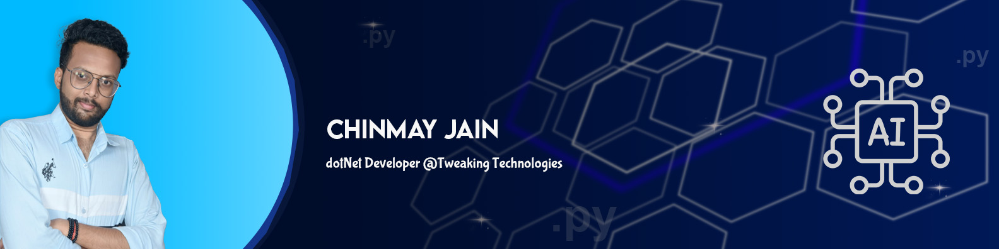

<!-- <!DOCTYPE html>
<html lang="en">
<head>
  <meta charset="UTF-8">
  <meta name="viewport" content="width=device-width, initial-scale=1.0">
  <link rel="stylesheet" href="styles.css">
  <link rel="preconnect" href="https://fonts.googleapis.com">
<link rel="preconnect" href="https://fonts.gstatic.com" crossorigin>
<link href="https://fonts.googleapis.com/css2?family=Syne:wght@400..800&display=swap" rel="stylesheet">
  <title>Document</title>
</head>
<body> -->
  

 

 “Building the future one line of code at a time.”

Currently, I am a dotNet developer as well as a Python developer at Tweaking Technologies, Jaipur.</li>
I am a computer science graduate from Lakshmi Narain College of Technology, Bhopal. I have worked as a data scientist intern at Forsk Coding School, Jaipur. I also published a research paper for my project, ATM Security Enhancement Using Computer Vision (CV).

Technology excites me, and I am always in awe of the change it drives in the world. Certain skills with which I have worked include ASP.NET, Windows Presentation Framework (WPF), Python, Django, Sqlite, and Tkinter. And what I might lack in skills, I make up for with my determination to learn. I am also working for some clients to build their websites in Django.

Outside of tech, I am a gamer, and I like planting plants.

For more details <a href="">visit here.</a>
 

<!-- 
</body>
</html> -->